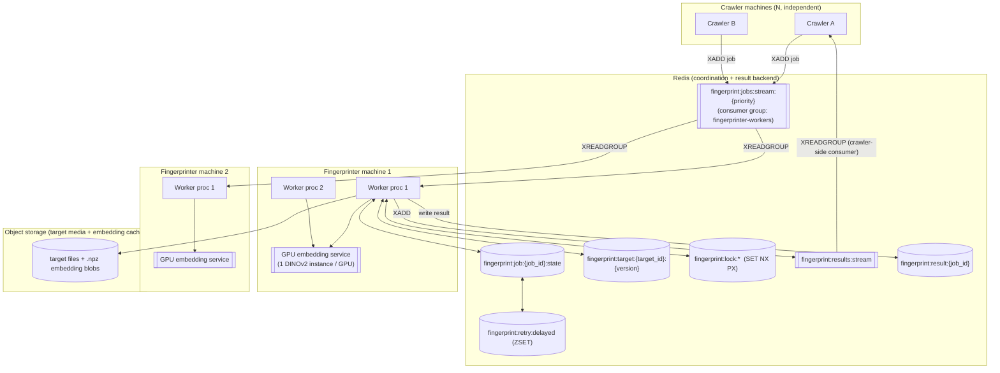

# Design Proposal 1 — New Fingerprinter Architecture (Redis-Coordinated)

Status: architecture proposal only, no implementation yet.

The existing fingerprinter (see `old/`) is research/prototype material. It will not be
refactored into production; this document defines a new, independently deployable
fingerprinter built around Redis as the sole coordination/backend surface between
crawler machines and fingerprinter workers.

Explicitly excluded from production: SQLite as a queue or Redis mirror, crawler SQLite
access from the fingerprinter, direct crawler Python imports, and shared-filesystem
assumptions between crawler and fingerprinter.

Concepts salvaged from the prototype: DINOv2 config shape (fps, cosine/L2/margin
thresholds, consecutive-run params), the target-embedding cache-key idea (path + size +
mtime + model + fps + algo), the media-type/duration gates as pure functions, and the
download-with-range/local-file/Tor logic. Not salvaged: SQLite `JobQueue` /
`CrawlerMediaQueue`, direct crawler DB access, mtime-based cache invalidation (unsafe
across machines).

---

## 1. Architecture Diagram



Crawlers never see fingerprinter internals; the fingerprinter never sees crawler DB.
Redis is the only shared surface.

---

## 2. Component List

| Component | Role | Runs on |
|---|---|---|
| **Job producer** (library used by crawler) | Formats and `XADD`s job entries | Crawler machines |
| **Redis** | Streams (jobs, results), hashes (state, target registry), ZSET (delayed retry), locks | Dedicated Redis service (HA deferred) |
| **Fingerprint worker** | Claims jobs, runs full pipeline, writes results | Fingerprinter machines, N per machine |
| **GPU embedding service** | Owns the loaded DINOv2 model per GPU; workers call in, don't load their own | Fingerprinter machines, 1 per GPU |
| **Target registry / cache manager** | Resolves target_id+version → embedding index, builds on cache miss under lock | Library used by workers |
| **Object storage** | Target source media + serialized embedding indexes (`.npz`) | External (S3-compatible) |
| **Retry/lease janitor** | Periodic `XAUTOCLAIM` for stale PEL entries, promotes due delayed retries | Any worker process (self-healing, no single instance) |
| **Result consumer** (crawler-side, out of scope) | Reads `fingerprint:results:stream`, updates crawler's own storage | Crawler machines |

---

## 3. Redis Job Lifecycle

Mechanism: **Redis Streams + consumer groups** (not List/BRPOPLPUSH) — gives atomic
claim, built-in Pending Entries List (PEL) for lease tracking, and `XAUTOCLAIM` for
stale-worker recovery natively, instead of reimplementing a reaper.

- **Creation**: crawler `XADD fingerprint:jobs:stream:{priority} * job_id=... media_evidence_id=... media_url=... media_type=... source_domain=... target_id=... target_version=... techniques=... max_attempts=...`. Immutable — the stream entry *is* the job spec.
- **Claim**: worker `XREADGROUP GROUP fingerprinter-workers CONSUMER worker-{host}-{pid} COUNT 1 BLOCK 5000 STREAMS fingerprint:jobs:stream:{priority} >`. Redis atomically assigns the entry to this consumer's PEL. Worker upserts `fingerprint:job:{job_id}:state` (status=claimed, worker_id, claimed_at, attempt+=1).
- **Lease/heartbeat**: PEL idle-time is tracked by Redis automatically from delivery time. No manual heartbeat needed for *detection*; a long-running job self-extends by periodic `XCLAIM` on its own entry (resets idle timer) if processing may exceed the stale threshold.
- **Stale-worker protection**: any worker, before blocking on new work, runs `XAUTOCLAIM ... MIN-IDLE-TIME <lease_ttl>` on the stream/group. This reclaims entries whose owning consumer died mid-job. Reclaimed entries go through the same attempt-count check as an explicit failure.
- **Retry**: on failure, worker reads `attempt` from state hash. If `attempt < max_attempts`: `XACK` the original entry (removes from PEL) and either re-`XADD` immediately or schedule via `fingerprint:retry:delayed` ZSET (score = `ready_at`), with the janitor moving due entries back into the stream (gives backoff). If `attempt >= max_attempts`: terminal failure, `XACK`, write failure result.
- **Completion**: worker writes result (§4), then `XACK`s the message. ACK is the authoritative "done" signal for the queue — a job with a result but no ACK is still considered in-flight until reclaimed.
- **Failure**: same as retry path when attempts exhausted — result written with `match_decision=failed` and failure detail, message ACKed, no further redelivery.

---

## 4. Redis Result Schema

`fingerprint:result:{job_id}` (hash; nested structures JSON-encoded as string fields),
plus a lightweight `XADD` to `fingerprint:results:stream` so the crawler can consume
without polling per-key.

```
job_id                  string
media_evidence_id       string   # crawler's reference to the sample, opaque to us
target_id               string
target_version          string
match_decision          enum(matched | no_match | uncertain | failed | rejected_non_video | rejected_too_short)
confidence_score         float
algorithm_version        string  # e.g. "dinov2_v1"
model_name               string  # e.g. "facebook/dinov2-base"
evidence                 json    # best_run window, frame indices/timestamps, per-stage scores
processing_metadata      json    # worker_id, host, gpu_used, duration_ms, attempt, download_bytes
failure                  json|null  # {stage, reason, exception_type} when decision indicates failure
created_at / completed_at  timestamps
```

`match_decision=uncertain` and `=no_match` are **successful completions**, not
failures — kept distinct from `failed` (§7).

---

## 5. Worker Lifecycle

```
claim (XREADGROUP)
  │
  ▼
resolve media (parse job → url, target_id/version, techniques)
  │
  ▼
download (candidate only; target resolved via cache, not downloaded per-job)
  │  ├─ media_type_gate → rejected_non_video (terminal, not a failure)
  │
  ▼
validate/probe (ffprobe/ffmpeg; duration_gate → rejected_too_short)
  │  ├─ decode failure → terminal failure
  │
  ▼
sample (2 FPS frame extraction from candidate)
  │
  ▼
embed (call GPU embedding service; candidate frames → vectors)
  │  ├─ resolve/build target embedding via target cache manager (§8)
  │
  ▼
match (cosine + L2 + margin per frame, best-target-index retrieval)
  │
  ▼
aggregate evidence (consecutive-run detection, temporal consistency, combined score)
  │
  ▼
write result (§4) + XACK
```

Each stage has a defined exit that maps to a `match_decision`/failure category (§7) —
no stage silently swallows an error into "uncertain."

---

## 6. DINOv2 v1 Pipeline

Directly reuses prototype math; parameters below are **initial calibration values
carried over from the prototype, not production-validated**:

| Parameter | Prototype value | Status |
|---|---|---|
| target/candidate sample fps | 2.0 | initial |
| cosine_threshold | 0.93 | initial |
| l2_score_threshold | 0.70 | initial |
| margin_threshold | 0.03 | initial |
| min_consecutive_frames | 6 | initial |
| max_target_frame_step | 3 | initial |
| min_run_avg_cosine | 0.94 | initial |
| low/high decision threshold | 0.20 / 0.65–0.80 | initial |

Pipeline: normalize embeddings → per-candidate-frame nearest target frame (cosine
similarity matrix) → derive L2-equivalent score and margin-to-second-best → accept
frames passing all three thresholds → build consecutive runs bounded by
`max_target_frame_step` → score best run (cosine, L2, margin, coverage, temporal
consistency) → combine with global accepted-ratio → threshold into `matched` /
`uncertain` / `no_match`. This logic is a pure function of two embedding matrices — it
has no dependency on how the embeddings were produced, so it can call into a remote GPU
embedding service exactly as easily as an in-process model.

---

## 7. Failure / Retry Model

| Boundary | Example | Retryable? | Result |
|---|---|---|---|
| Download failure — transient | timeout, connection reset | yes, bounded | requeued via delayed retry |
| Download failure — terminal | 404, unsupported scheme | no | `failed`, stage=download |
| Invalid media | zero-byte file, corrupt container | no | `failed`, stage=validate |
| Unsupported media | non-video type, `.onion` w/o Tor | no (business rule, not error) | `rejected_non_video` |
| Too short | below duration threshold | no (business rule) | `rejected_too_short` |
| Decode failure | ffprobe/opencv can't read frames | limited (1 retry, transient resource contention) | `failed`, stage=decode |
| Model/GPU failure | CUDA OOM, model load error | yes, bounded — may succeed on another host with free VRAM | requeued; alert if repeated across jobs (capacity signal) |
| Fingerprint mismatch | low score, no run qualifies | **not a failure** | `no_match` / `uncertain`, completed |
| Worker crash | process dies mid-job | implicit — lease expires, `XAUTOCLAIM` reclaims | counts as one attempt |
| Redis failure | connection refused/timeout | workers back off and retry connecting; **no local queue fallback** (per constraint) — claiming pauses fleet-wide | requires Redis HA (deferred) |

---

## 8. Target / Cache Model

- **Target identity**: `target_id` — an identifier assigned by rights-holder/ops tooling, independent of any crawler asset id.
- **Target version**: content hash (e.g. SHA-256) of the target file, *not* mtime — mtime is unsafe across machines/filesystems. New content ⇒ new version, old versions remain addressable.
- **Cache key**: `(target_id, target_version, model_name, sample_fps, algo_version)` → deterministic key, mirrors the prototype's `target_embedding_cache_key`.
- **Storage**: target source file + serialized embedding index (`.npz`-equivalent) live in object storage, not local disk — any worker on any machine can resolve the same cache.
- **Registry**: `fingerprint:target:{target_id}:{version}` hash in Redis holds cache location, frame count, embedding dims, model_name, sample_fps, created_at, checksum — the pointer, not the blob.
- **Build-on-miss race**: multiple workers on different machines can miss the same cache key simultaneously. Guard with `SET fingerprint:lock:target:{cache_key} NX PX <ttl>`; losers poll/wait for the registry entry rather than duplicating the embedding pass.
- **Invalidation**: changing `model_name` or `algo_version` produces a disjoint cache key automatically — no explicit invalidation needed for model upgrades, and rollback is just addressing the old key. Explicit deletion (GC) of stale target versions is an ops action, deferred.

---

## 9. Distributed Deployment Model

- N crawler machines: fire-and-forget `XADD` producers, no coordination needed between them.
- N fingerprinter machines, each running M worker processes; workers on a machine share that machine's GPU embedding service(s).
- **Atomicity/lease-critical points**:
  1. Job claim — `XREADGROUP` (atomic, Redis-native).
  2. Stale reclaim — `XAUTOCLAIM` (atomic, Redis-native).
  3. Target cache build — needs explicit lock (`SET NX PX`), not Redis-native for this use case.
  4. Delayed-retry promotion — needs atomic read+move (Lua script or `MULTI`), owned by the janitor logic.
  5. Result write + ACK — no cross-worker contention (one job_id, one owner), but write-then-ACK ordering matters: a crash between the two must leave the job reclaimable (ACK last).

---

## 10. Resource Boundaries

- **CPU-bound**: download, ffprobe/ffmpeg probing, frame extraction/decode (opencv). Can scale by adding worker processes freely.
- **GPU/VRAM-bound**: DINOv2 forward pass. This is the constrained resource — **must not** be "one model instance per worker process." Boundary: a dedicated embedding service per GPU that all local worker processes call into, decoupling job concurrency (CPU-bound, cheap to scale) from model instance count (GPU-bound, expensive, must stay ≤ available VRAM). GPU scheduling/serving mechanism itself is deferred — this section only fixes the boundary, not the implementation.

---

## Deferred (explicitly out of scope for this proposal)

- GPU scheduling / model-serving implementation (queueing, batching, multi-GPU placement).
- Final choice of Streams vs. alternative Redis primitives (Streams recommended above, not mandated).
- Object storage backend choice for target media + embedding blobs.
- Retry backoff curve, lease TTL values, lock TTL values — all need real numbers.
- Production calibration of all DINOv2 thresholds (§6 table).
- Audio fingerprinting / multi-modal fusion revival (prototype had audio + sequence-alignment stages — not part of v1 scope here).
- Redis HA (replication/sentinel/cluster) and its effect on the "Redis failure" row in §7.
- Monitoring/alerting (esp. for repeated model/GPU failures as a capacity signal).
- Crawler-side result consumer implementation and schema mapping into crawler storage.
- Network/auth boundary between crawler↔Redis, fingerprinter↔Redis (ACLs, TLS).
- Deployment orchestration (k8s/compose/bare metal) and autoscaling policy.
- Dead-letter tooling/UI for terminally failed jobs.
- Target ingestion/registration workflow and API surface (who creates `target_id`s and uploads content).
- Downloaded-candidate retention/cleanup policy on fingerprinter disks.
- Per-source-domain rate limiting.
